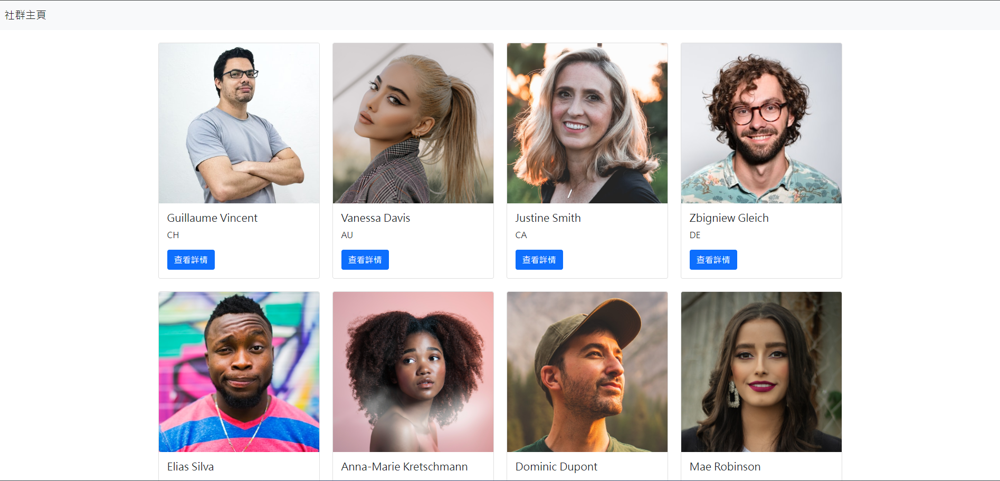
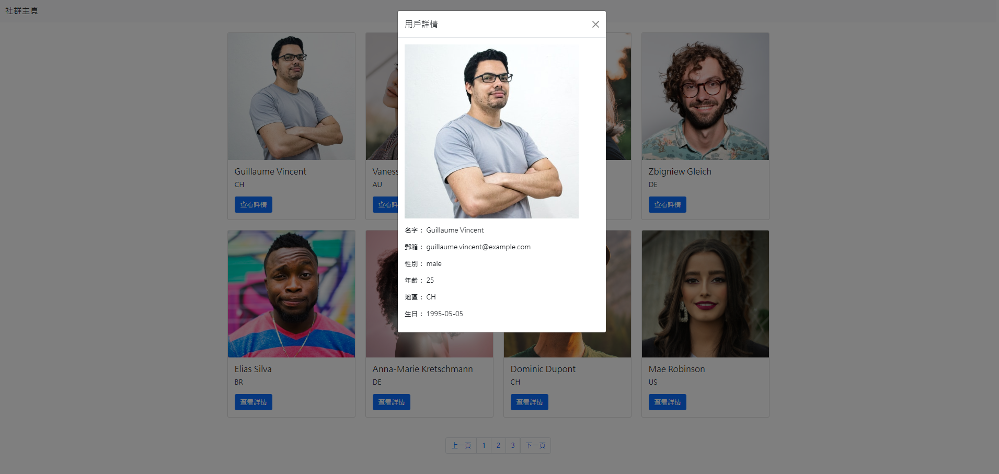

# S21_A11_Q1_組裝我的社群主頁(Building_Social_Profile_Page)

AlphaCamp學期2-1，A11作業專案的社群主頁，  
使用 HTML、CSS 和 JavaScript 以及 Bootstrap 框架打造的社群網站。

## 功能描述

- 網站的目的是展示一個簡單的社群主頁，呈現使用者卡片和詳細資訊。
- 使用者可以查看多個使用者的基本信息卡片。
- 點擊"查看詳情"按鈕可以打開模態框，顯示使用者的詳細資訊。
- 使用 Bootstrap 組件快速構建響應式佈局。

## 專案範例




### 安裝與執行步驟

1. 下載專案到本地端
```
git clone https://github.com/CarolLiuXQ/S21_A11_Q1_Building_Social_Profile_Page.git
```

2. 在本地端資料夾中使用
直接將 `index.html` 拖曳至瀏覽器中查看，或使用 Live Server 套件運行。

3. 如果要使用 Node.js 服務器運行（可選）：
   - 確保安裝了 Node.js
   - 在專案目錄中運行：
     ```
     node server.js
     ```
   - 在瀏覽器中訪問 `http://localhost:3000`

## 環境建置與需求

- 網頁瀏覽器（推薦使用 Google Chrome）
- [Visual Studio Code](https://visualstudio.microsoft.com/zh-hant/) - 最新版本
- [Node.js](https://nodejs.org/) - 如果使用 Node.js server運行

## 使用技術

- HTML5
- CSS3
- JavaScript (ES6+)
- [Bootstrap 5](https://getbootstrap.com/)

## License
© [CarolLiuXQ](https://github.com/CarolLiuXQ/)