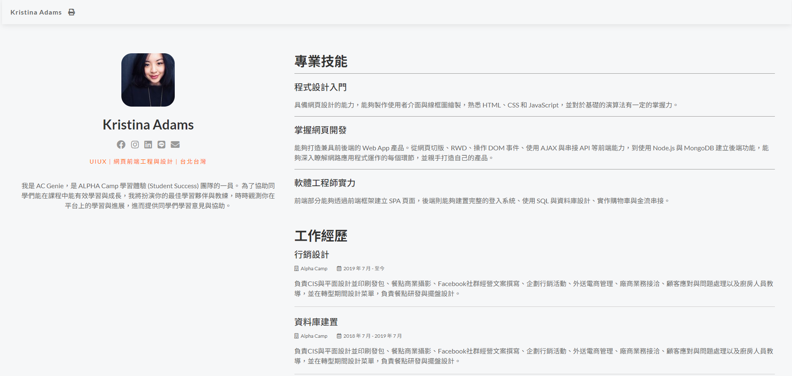
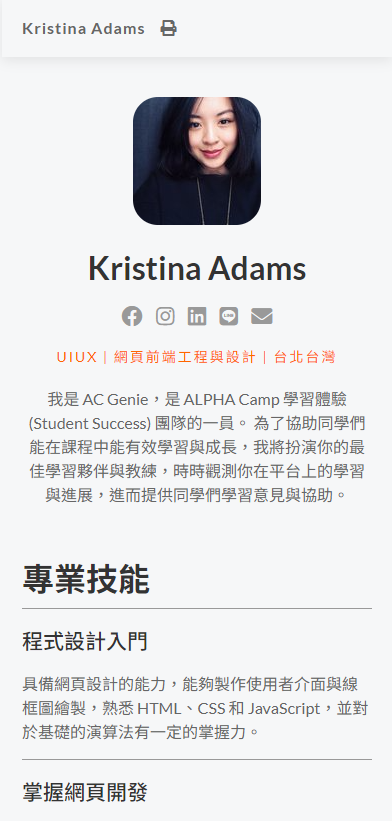

# S21_A11_Q2_我的社群主頁-RWD 實作應用(My_Social_Page_RWD_Practice)

AlphaCamp 學期2-1，A11 作業專案的個人社群主頁，
使用 HTML、CSS 和 JavaScript 打造的 RWD（響應式網頁設計）個人簡歷網站。

## 功能描述

- 網站的目的是展示個人資訊、專業技能和工作經歷。
- 採用響應式設計，可適配不同尺寸的裝置螢幕。
- 包含個人頭像、社群媒體連結、專業技能描述和詳細的工作經歷。
- 使用 Node.js 建立簡單的伺服器來託管靜態檔案。

## 專案範例




### 安裝與執行步驟

1. 複製專案到本機
```
git clone https://github.com/CarolLiuXQ/S21_A11_Q2_My_Social_Page_RWD_Practice.git
```

2. 進入專案資料夾
```
cd S21_A11_Q2_My_Social_Page_RWD_Practice
```

3. 啟動伺服器
```
node index.js
```

4. 開啟瀏覽器，輸入 http://localhost:3000 即可瀏覽網頁

## 環境建置與需求

- [Node.js](https://nodejs.org/) - JavaScript 執行環境
- [Visual Studio Code](https://code.visualstudio.com/) - 建議使用的程式碼編輯器

## 使用技術

- HTML5
- CSS3（使用 RWD 技術）
- JavaScript (ES6+)
- Node.js

## 專案結構

- `index.html`: 主要的 HTML 檔案
- `style.css`: 樣式表檔案
- `index.js`: Node.js 伺服器檔案

## 開發者

[CarolLiuXQ](https://github.com/CarolLiuXQ)

## License
© [CarolLiuXQ] 版權所有