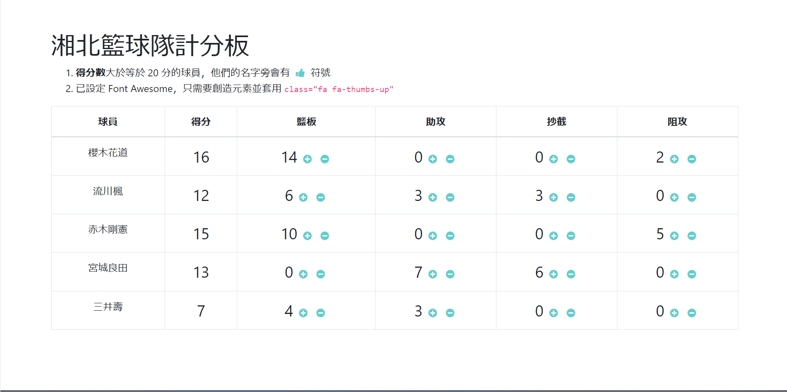

# S21_A17_Q1_湘北籃球隊計分板 (Shohoku_Basketball_Team_Scoreboard)

AlphaCamp 學期2-1，A17 作業專案的湘北籃球隊計分板，
使用 HTML、CSS 和 JavaScript 打造的動態計分板網頁應用程式。

## 功能描述

- 展示湘北籃球隊球員的比賽數據，包括得分、籃板、助攻、抄截和阻攻。
- 動態計算球員得分（籃板 + 助攻 + 抄截 + 阻攻的總和）。
- 對於得分大於等於 20 分的球員，在其名字旁顯示 👍 圖示。
- 允許使用者透過點擊 + 或 - 按鈕來調整球員的籃板、助攻、抄截和阻攻數據。
- 使用 Node.js 建立簡單的伺服器來託管靜態檔案。

## 專案範例



### 安裝與執行步驟

1. 複製專案到本機
```
git clone https://github.com/CarolLiuXQ/S21_A17_Q1_Shohoku_Basketball_Team_Scoreboard.git
```

2. 進入專案資料夾
```
cd S21_A17_Q1_Shohoku_Basketball_Team_Scoreboard
```

3. 啟動伺服器
```
node server.js
```

4. 開啟瀏覽器，輸入 http://localhost:3000 即可瀏覽網頁

## 環境建置與需求

- [Node.js](https://nodejs.org/) - JavaScript 執行環境
- [Visual Studio Code](https://code.visualstudio.com/) - 建議使用的程式碼編輯器

## 使用技術

- HTML5
- CSS3
- JavaScript (ES6+)
- Node.js

## 專案結構

- `index.html`: 主要的 HTML 檔案
- `style.css`: 樣式表檔案
- `index.js`: 前端 JavaScript 檔案
- `server.js`: Node.js 伺服器檔案

## 開發者

[CarolLiuXQ](https://github.com/CarolLiuXQ)

## License
© [CarolLiuXQ] 版權所有