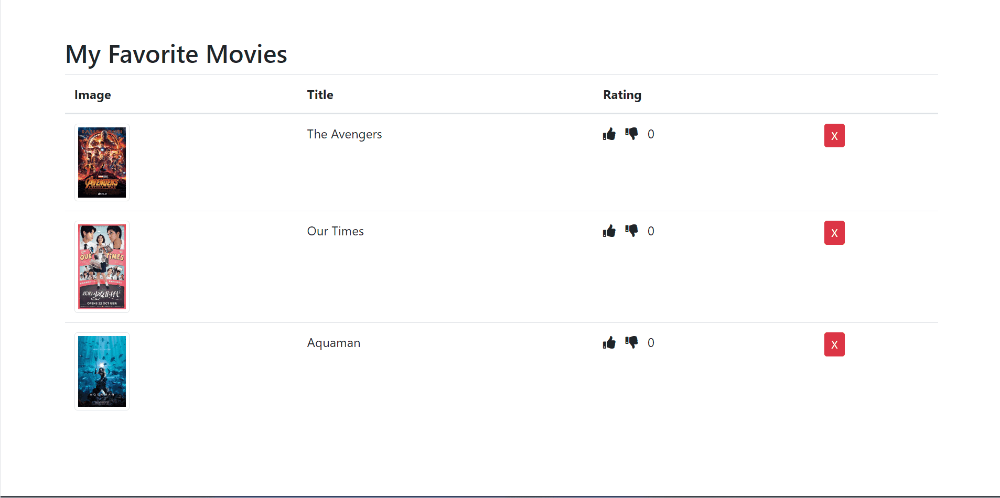

# S21_A22_Q1_My_Favorite_Movies_GoodBad

AlphaCamp 學期2-1，A22 作業專案的我的最愛電影清單，
使用 HTML、CSS 和 JavaScript 打造的動態電影評分網頁應用程式。

## 功能描述

- 展示一個包含電影海報、標題和評分的電影清單。
- 允許使用者對電影進行評分（點讚或倒讚）。
- 即時更新電影的評分。
- 允許使用者從清單中移除電影。
- 使用 Node.js 建立簡單的伺服器來託管靜態檔案。

## 專案範例



### 安裝與執行步驟

1. 複製專案到本機
```
git clone https://github.com/CarolLiuXQ/S21_A22_Q1_My_Favorite_Movies_GoodBad.git
```

2. 進入專案資料夾
```
cd S21_A22_Q1_My_Favorite_Movies_GoodBad
```

3. 啟動伺服器
```
node server.js
```

4. 開啟瀏覽器，輸入 http://localhost:3000 即可瀏覽網頁

## 環境建置與需求

- [Node.js](https://nodejs.org/) - JavaScript 執行環境
- [Visual Studio Code](https://code.visualstudio.com/) - 建議使用的程式碼編輯器

## 使用技術

- HTML5
- CSS3
- JavaScript (ES6+)
- Node.js
- Bootstrap（用於樣式和佈局）
- Font Awesome（用於圖示）

## 專案結構

- `index.html`: 主要的 HTML 檔案
- `style.css`: 樣式表檔案
- `index.js`: 前端 JavaScript 檔案，處理動態功能
- `server.js`: Node.js 伺服器檔案

## 功能說明

1. **電影清單顯示**：
   - 顯示電影海報、標題和當前評分。

2. **互動評分系統**：
   - 點擊拇指向上圖示增加評分。
   - 點擊拇指向下圖示減少評分（最低為 0）。

3. **移除電影**：
   - 點擊 "X" 按鈕可從清單中移除電影。

4. **動態更新**：
   - 評分變更時即時反映在頁面上。

## 開發者

[CarolLiuXQ](https://github.com/CarolLiuXQ)

## License
© [CarolLiuXQ] 版權所有