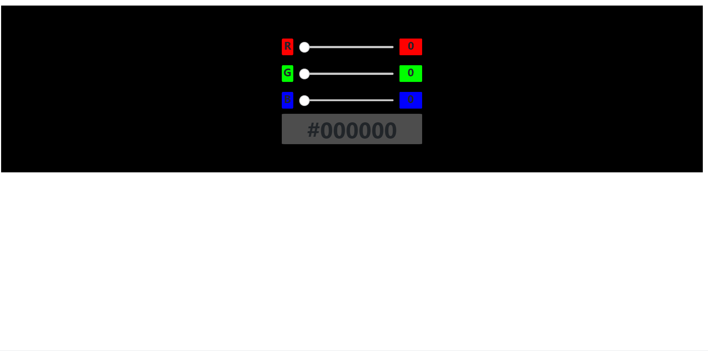

# S21_A23_Q1_RGBtoHexConverter_Challenge

AlphaCamp 學期2-1，A23 作業專案的進階 RGB 到 HEX 轉換器，
使用 HTML、CSS 和 JavaScript 打造的動態顏色轉換網頁應用程式。

## 功能描述

- 提供 RGB 顏色滑動條介面，包含紅（R）、綠（G）、藍（B）三個可調整的滑動條。
- 即時將 RGB 值轉換為對應的 HEX 顏色代碼。
- 顯示 RGB 各分量的顏色預覽方塊和數值。
- 顯示合成後的 HEX 顏色代碼。
- 實時更新背景顏色以反映當前選擇的顏色。
- 使用 Node.js 建立簡單的伺服器來託管靜態檔案。

## 專案範例




### 安裝與執行步驟

1. 複製專案到本機
```
git clone https://github.com/CarolLiuXQ/S21_A23_Q1_RGBtoHexConverter_Challenge.git
```

2. 進入專案資料夾
```
cd S21_A23_Q1_RGBtoHexConverter_Challenge
```

3. 啟動伺服器
```
node server.js
```

4. 開啟瀏覽器，輸入 http://localhost:3000 即可瀏覽網頁

## 環境建置與需求

- [Node.js](https://nodejs.org/) - JavaScript 執行環境
- [Visual Studio Code](https://code.visualstudio.com/) - 建議使用的程式碼編輯器

## 使用技術

- HTML5
- CSS3
- JavaScript (ES6+)
- Node.js

## 專案結構

- `index.html`: 主要的 HTML 檔案，包含顏色選擇器的結構
- `style.css`: 樣式表檔案，定義了滑動條和顏色預覽的樣式
- `index.js`: 前端 JavaScript 檔案，處理動態功能和顏色轉換邏輯
- `server.js`: Node.js 伺服器檔案，用於託管靜態檔案

## 功能說明

1. **RGB 滑動條輸入**：
   - 提供紅（R）、綠（G）、藍（B）三個滑動條，可調整 0-255 的數值。

2. **即時顏色預覽**：
   - 顯示 RGB 各個分量的顏色預覽方塊。
   - 顯示每個分量的當前數值。

3. **RGB 到 HEX 轉換**：
   - 自動將 RGB 值轉換為對應的 HEX 顏色代碼。

4. **動態背景更新**：
   - 隨著滑動條的調整，即時更新網頁背景顏色。

5. **自定義滑動條樣式**：
   - 使用 CSS 自定義滑動條的外觀，提供更好的用戶體驗。

## 開發者

[CarolLiuXQ](https://github.com/CarolLiuXQ)

## License
© [CarolLiuXQ] 版權所有