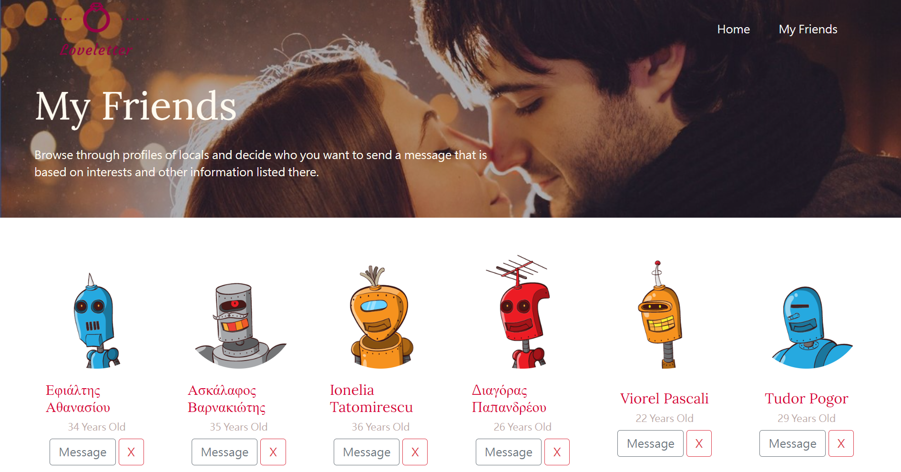

# S22_A11_Q1_Loveletter

AlphaCamp 學期2-2，A11 作業專案的交友網站應用程式，
使用 HTML、CSS 和 JavaScript 打造的動態網頁應用程式，實現用戶瀏覽、搜索和添加好友的功能。

## 功能描述

- 顯示隨機用戶列表，包含頭像、姓名和年齡。
- 提供搜索功能，可以根據姓名搜索用戶。
- 允許用戶添加好友到自己的好友列表。
- 提供我的好友頁面，顯示已添加的好友。
- 支持分頁功能，每頁顯示固定數量的用戶。
- 點擊用戶頭像可查看詳細信息。
- 響應式設計，適配不同設備。
- 使用 Node.js 和 Express 建立簡單的伺服器來託管靜態檔案。

## 專案範例





### 安裝與執行步驟

1. 複製專案到本機
```
git clone https://github.com/CarolLiuXQ/S22_A11_Q1_Loveletter.git
```

2. 進入專案資料夾
```
cd S22_A11_Q1_Loveletter
```

3. 安裝相依套件
```
npm install
```

4. 啟動伺服器
```
node server.js
```

5. 開啟瀏覽器，輸入 http://localhost:3000 即可瀏覽網頁

## 環境建置與需求

- [Node.js](https://nodejs.org/) - JavaScript 執行環境
- [Express](https://expressjs.com/) - Web 應用框架
- [Visual Studio Code](https://code.visualstudio.com/) - 建議使用的程式碼編輯器

## 使用技術

- HTML5
- CSS3
- JavaScript (ES6+)
- Node.js
- Express.js
- Axios (用於 API 請求)
- Bootstrap (用於頁面布局和樣式)

## 專案結構

- `index.html`: 主頁 HTML 檔案
- `friendList.html`: 好友列表頁面 HTML 檔案
- `index.js`: 主頁 JavaScript 檔案，處理用戶列表和搜索功能
- `friendList.js`: 好友列表頁面 JavaScript 檔案
- `server.js`: Express 伺服器檔案，用於託管靜態檔案
- `public/stylesheets/`: 存放 CSS 和圖片資源

## 功能說明

1. **用戶列表顯示**：
   - 顯示隨機用戶的頭像、姓名和年齡。
   - 支持分頁功能，每頁顯示 18 個用戶。

2. **搜索功能**：
   - 可以通過姓名搜索用戶。

3. **添加好友**：
   - 點擊 "+" 按鈕將用戶添加到好友列表。

4. **查看用戶詳情**：
   - 點擊用戶頭像可查看詳細信息，包括電子郵件、性別、地區和生日。

5. **我的好友頁面**：
   - 顯示已添加的好友列表。
   - 支持移除好友功能。

6. **響應式導航欄**：
   - 滾動時導航欄固定在頁面頂部。

## 開發者

[CarolLiuXQ](https://github.com/CarolLiuXQ)

## License
© [CarolLiuXQ] 版權所有
