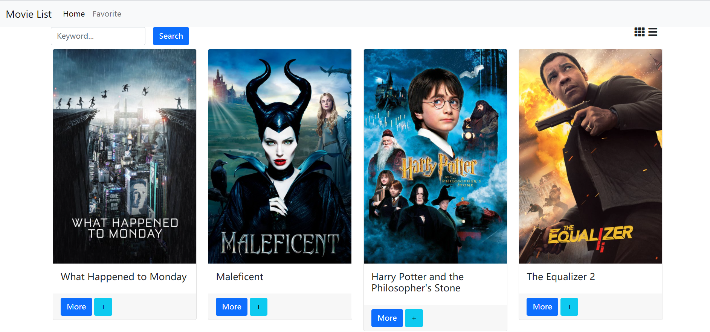
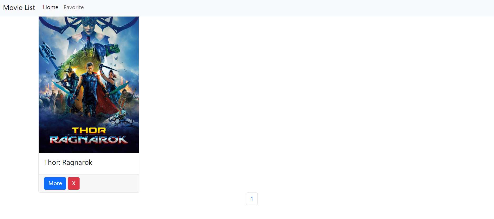

# S22_A12_Q1_MovieList_GridList

AlphaCamp 學期2-2，A12 作業專案的電影列表應用程式，
使用 HTML、CSS 和 JavaScript 打造的動態網頁應用程式，實現電影列表的顯示、搜索和收藏功能。

## 功能描述

- 顯示電影列表，包含電影海報、標題和操作按鈕。
- 支持網格視圖和列表視圖的切換。
- 提供搜索功能，可以根據電影標題搜索。
- 允許用戶將電影添加到收藏列表。
- 支持分頁功能，每頁顯示固定數量的電影。
- 點擊電影可查看詳細信息。
- 提供收藏頁面，顯示已收藏的電影。
- 使用 Node.js 和 Express 建立簡單的伺服器來託管靜態檔案。

## 專案範例





### 安裝與執行步驟

1. 複製專案到本機
```
git clone https://github.com/CarolLiuXQ/S22_A12_Q1_MovieList_GridList.git
```

2. 進入專案資料夾
```
cd S22_A12_Q1_MovieList_GridList
```

3. 安裝相依套件
```
npm install
```

4. 啟動伺服器
```
node server.js
```

5. 開啟瀏覽器，輸入 http://localhost:3000 即可瀏覽網頁

## 環境建置與需求

- [Node.js](https://nodejs.org/) - JavaScript 執行環境
- [Express](https://expressjs.com/) - Web 應用框架
- [Visual Studio Code](https://code.visualstudio.com/) - 建議使用的程式碼編輯器

## 使用技術

- HTML5
- CSS3
- JavaScript (ES6+)
- Node.js
- Express.js
- Axios (用於 API 請求)
- Bootstrap (用於頁面布局和樣式)

## 專案結構

- `index.html`: 主頁 HTML 檔案
- `favorite.html`: 收藏頁面 HTML 檔案
- `index.js`: 主頁 JavaScript 檔案，處理電影列表顯示和搜索功能
- `favorite.js`: 收藏頁面 JavaScript 檔案
- `server.js`: Express 伺服器檔案，用於託管靜態檔案

## 功能說明

1. **電影列表顯示**：
   - 支持網格視圖和列表視圖的切換。
   - 每頁顯示 12 部電影，支持分頁功能。

2. **搜索功能**：
   - 可以通過電影標題搜索電影。

3. **收藏功能**：
   - 點擊 "+" 按鈕將電影添加到收藏列表。

4. **查看電影詳情**：
   - 點擊 "More" 按鈕可查看電影詳細信息。

5. **收藏頁面**：
   - 顯示已收藏的電影列表。
   - 支持移除收藏功能。

6. **視圖切換**：
   - 可以在網格視圖和列表視圖之間切換。

7. **本地存儲**：
   - 使用 localStorage 保存用戶的收藏列表和視圖偏好。

## 開發者

[CarolLiuXQ](https://github.com/CarolLiuXQ)

## License
© [CarolLiuXQ] 版權所有