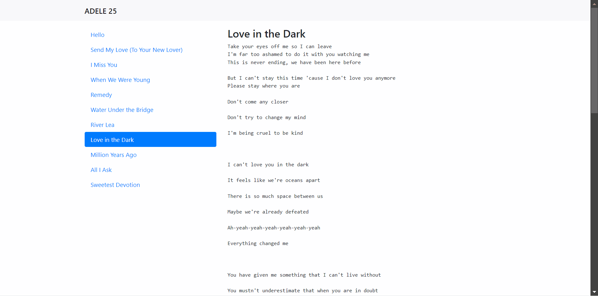

# S22_A3_Q1_AdeleLyricsList

AlphaCamp 學期2-2，A3 作業專案的 Adele 歌詞列表，
使用 HTML、CSS 和 JavaScript 打造的動態網頁應用程式，通過 API 獲取 Adele 的歌詞資訊。

## 功能描述

- 顯示 Adele 的 "25" 專輯歌曲列表。
- 點擊歌曲名稱可以查看對應的歌詞。
- 使用 axios 庫從 Firebase API 獲取歌詞數據。
- 實現歌曲列表和歌詞面板的切換功能。
- 在加載歌詞時顯示 loading 動畫。
- 使用 Node.js 建立簡單的伺服器來託管靜態檔案。

## 專案範例



### 安裝與執行步驟

1. 複製專案到本機
```
git clone https://github.com/CarolLiuXQ/S22_A3_Q1_AdeleLyricsList.git
```

2. 進入專案資料夾
```
cd S22_A3_Q1_AdeleLyricsList
```

3. 啟動伺服器
```
node server.js
```

4. 開啟瀏覽器，輸入 http://localhost:3000 即可瀏覽網頁

## 環境建置與需求

- [Node.js](https://nodejs.org/) - JavaScript 執行環境
- [Visual Studio Code](https://code.visualstudio.com/) - 建議使用的程式碼編輯器

## 使用技術

- HTML5
- CSS3
- JavaScript (ES6+)
- Node.js
- axios (用於 API 請求)
- Bootstrap (用於頁面布局和樣式)

## 專案結構

- `index.html`: 主要的 HTML 檔案，包含頁面結構
- `style.css`: 樣式表檔案，定義了頁面的自定義樣式
- `index.js`: 前端 JavaScript 檔案，處理動態功能和 API 請求
- `server.js`: Node.js 伺服器檔案，用於託管靜態檔案

## 功能說明

1. **歌曲列表顯示**：
   - 顯示 Adele "25" 專輯的所有歌曲名稱。

2. **歌詞查看**：
   - 點擊歌曲名稱可以在右側面板查看對應的歌詞。

3. **動態加載**：
   - 使用 axios 從 Firebase API 動態獲取歌詞數據。

4. **Loading 動畫**：
   - 在歌詞加載過程中顯示 loading 動畫。

5. **響應式設計**：
   - 使用 Bootstrap 實現響應式布局，適配不同設備。

## 開發者

[CarolLiuXQ](https://github.com/CarolLiuXQ)

## License
© [CarolLiuXQ] 版權所有