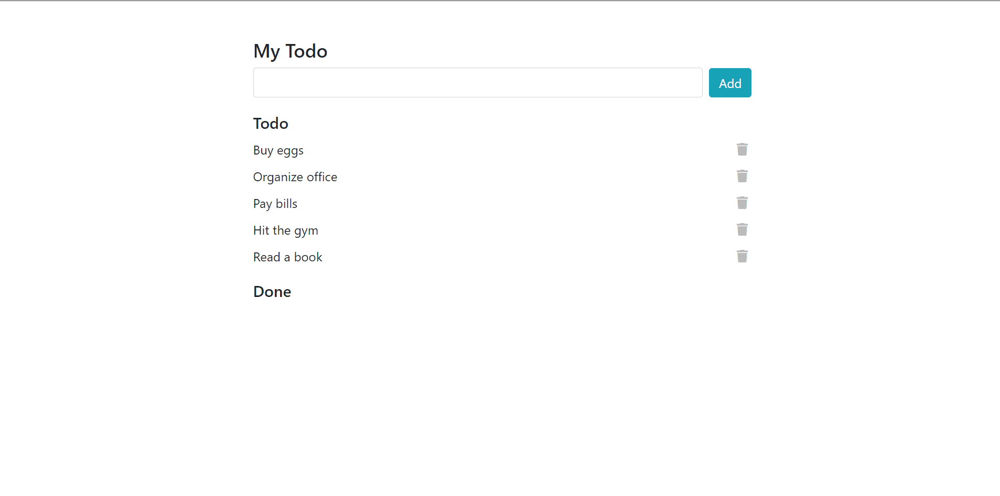

# S22_A4_Q1_TodoList

AlphaCamp 學期2-2，A4 作業專案的待辦事項列表，
使用 HTML、CSS 和 JavaScript 打造的動態網頁應用程式，實現待辦事項的管理功能。

## 功能描述

- 顯示待辦事項和已完成事項列表。
- 允許用戶添加新的待辦事項。
- 可以將待辦事項標記為已完成或取消完成狀態。
- 支持刪除待辦事項和已完成事項。
- 提供輸入驗證，防止添加空白待辦事項。
- 使用 Node.js 建立簡單的伺服器來託管靜態檔案。

## 專案範例



### 安裝與執行步驟

1. 複製專案到本機
```
git clone https://github.com/CarolLiuXQ/S22_A4_Q1_TodoList.git
```

2. 進入專案資料夾
```
cd S22_A4_Q1_TodoList
```

3. 啟動伺服器
```
node server.js
```

4. 開啟瀏覽器，輸入 http://localhost:3000 即可瀏覽網頁

## 環境建置與需求

- [Node.js](https://nodejs.org/) - JavaScript 執行環境
- [Visual Studio Code](https://code.visualstudio.com/) - 建議使用的程式碼編輯器

## 使用技術

- HTML5
- CSS3
- JavaScript (ES6+)
- Node.js
- Bootstrap (用於頁面布局和樣式)
- Font Awesome (用於圖標)

## 專案結構

- `index.html`: 主要的 HTML 檔案，包含待辦事項列表的結構
- `style.css`: 樣式表檔案，定義了頁面的自定義樣式
- `index.js`: 前端 JavaScript 檔案，處理待辦事項的動態功能
- `server.js`: Node.js 伺服器檔案，用於託管靜態檔案

## 功能說明

1. **添加待辦事項**：
   - 在輸入框中輸入待辦事項，點擊 "Add" 按鈕或按 Enter 鍵添加。
   - 防止添加空白待辦事項，顯示錯誤提示。

2. **待辦事項管理**：
   - 顯示待辦事項列表。
   - 點擊待辦事項可將其標記為已完成，並移至 "Done" 列表。

3. **已完成事項管理**：
   - 顯示已完成事項列表。
   - 點擊已完成事項可將其恢復為待辦狀態，並移回 "Todo" 列表。

4. **刪除功能**：
   - 每個待辦事項和已完成事項旁有刪除按鈕，點擊可移除該項目。

5. **響應式設計**：
   - 使用 Bootstrap 實現響應式布局，適配不同設備。

## 開發者

[CarolLiuXQ](https://github.com/CarolLiuXQ)

## License
© [CarolLiuXQ] 版權所有