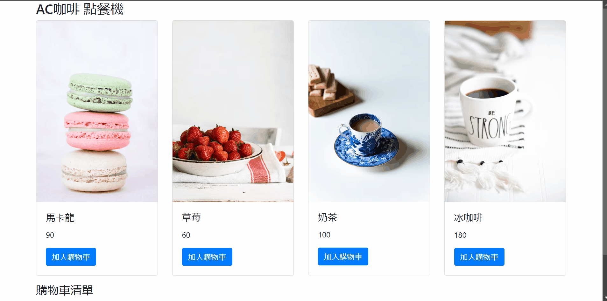

# S22_A5_Q1_EasyPOS_1.0

AlphaCamp 學期2-2，A5 作業專案的簡易銷售點系統（POS），
使用 HTML、CSS 和 JavaScript 打造的動態網頁應用程式，實現簡單的點餐和結帳功能。

## 功能描述

- 顯示商品菜單，包含圖片、名稱和價格。
- 允許用戶將商品加入購物車。
- 顯示購物車清單，包括已選商品及其數量。
- 自動計算總金額。
- 提供送出訂單功能，顯示訂單總結。
- 使用 Node.js 建立簡單的伺服器來託管靜態檔案。

## 專案範例



### 安裝與執行步驟

1. 複製專案到本機
```
git clone https://github.com/CarolLiuXQ/S22_A5_Q1_EasyPOS_1.0.git
```

2. 進入專案資料夾
```
cd S22_A5_Q1_EasyPOS_1.0
```

3. 啟動伺服器
```
node server.js
```

4. 開啟瀏覽器，輸入 http://localhost:3000 即可瀏覽網頁

## 環境建置與需求

- [Node.js](https://nodejs.org/) - JavaScript 執行環境
- [Visual Studio Code](https://code.visualstudio.com/) - 建議使用的程式碼編輯器

## 使用技術

- HTML5
- CSS3
- JavaScript (ES6+)
- Node.js
- Bootstrap (用於頁面布局和樣式)

## 專案結構

- `index.html`: 主要的 HTML 檔案，包含商品菜單和購物車的結構
- `index.js`: 前端 JavaScript 檔案，處理商品選擇、購物車更新和訂單提交的邏輯
- `server.js`: Node.js 伺服器檔案，用於託管靜態檔案

## 功能說明

1. **商品菜單顯示**：
   - 動態生成商品卡片，顯示商品圖片、名稱和價格。

2. **加入購物車**：
   - 點擊商品卡片上的 "加入購物車" 按鈕，將商品添加到購物車清單。

3. **購物車管理**：
   - 顯示已選商品的清單，包括商品名稱、數量和小計。
   - 自動計算並更新總金額。

4. **訂單提交**：
   - 點擊 "送出訂單" 按鈕，顯示訂單總結（總金額）。
   - 提供確認或取消選項。

5. **訂單確認**：
   - 確認訂單後，清空購物車和總金額，準備下一次訂單。

## 開發者

[CarolLiuXQ](https://github.com/CarolLiuXQ)

## License
© [CarolLiuXQ] 版權所有