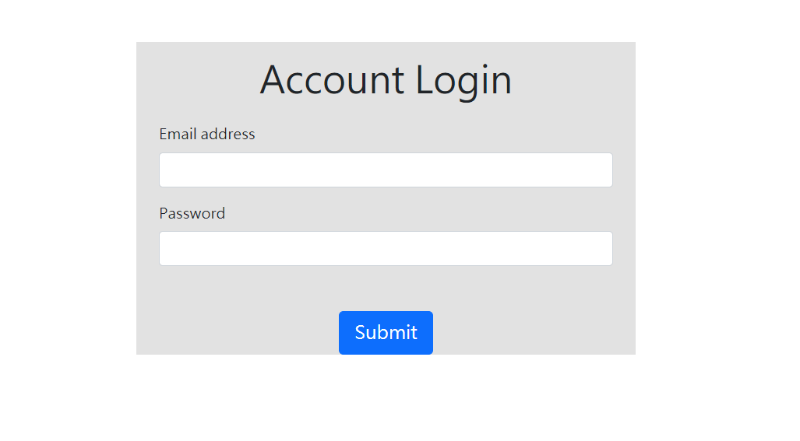
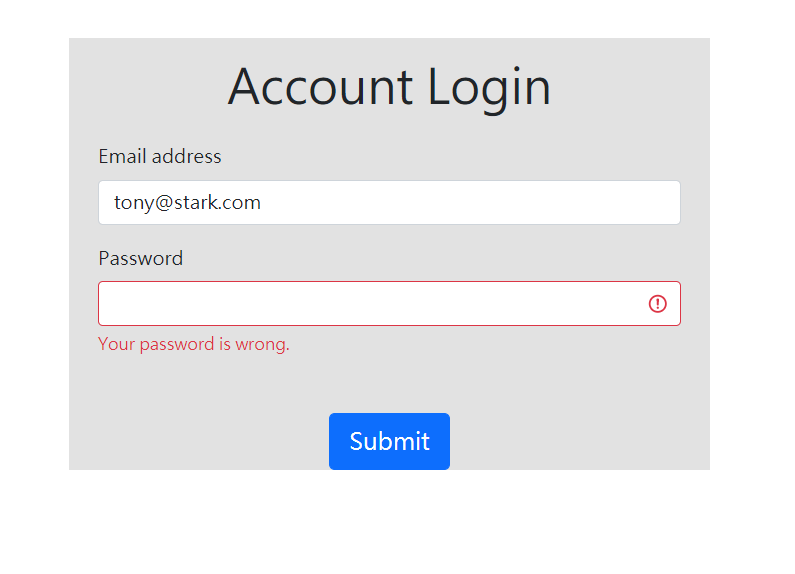

# AC學期2-3_A10_Q1_Login Page

AlphaCamp學期2-3，A10作業專案的Login Page，  
使用 Node.js , Express , express-handlebars 打造的login介面並認證資料。

## 功能描述

- 可在login畫面中輸入email和密碼
- 如果email驗證失敗會在login畫面中說密碼錯誤
- 如果無此email會顯示說沒有此帳號
- 驗證成功會轉跳home page，並顯示Welcome back + 使用者名稱

## Screenshots





### 安裝與執行步驟

1. 開啟終端機(Terminal)cd 到存放專案本機位置並執行:

```
git clone https://github.com/CarolLiuXQ/AC_S23_A10_Q1_check_password
```

2. 初始

```
cd S23_A10_Q1_check_password  //切至專案資料夾
```

```
npm install  //安裝套件
```

3. 啟動專案

```
npm run dev  //執行程式
```

4. 開始使用
終端顯示 `Express is listening on http://localhost:3000/login` 即啟動完成，請至[http://localhost:3000](http://localhost:3000/login)開始使用程式


## 環境建置與需求

- [Visual Studio Code](https://visualstudio.microsoft.com/zh-hant/) -1.57.1
- [Node Version Manager (nvm) for Windows](https://github.com/coreybutler/nvm-windows/releases) -1.1.7
- npm -6.14.13
- [Express](https://www.npmjs.com/package/express)
- [Express-Handlebars](https://www.npmjs.com/package/express-handlebars)
- [body-parser](https://www.npmjs.com/package/body-parser)
- [nodemon](https://www.npmjs.com/package/nodemon)


## License
© [CarolLiu](https://github.com/CarolLiuXQ/)