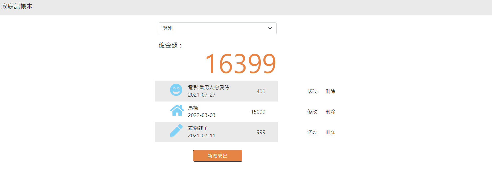
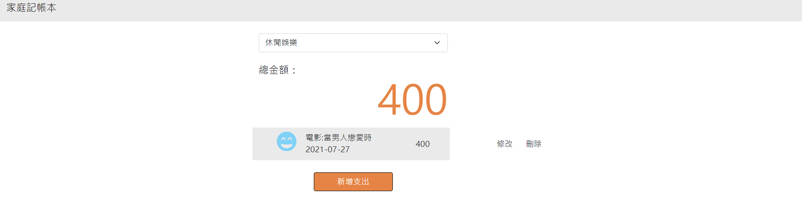

# AC學期2-3_A12_Q1_Expense Tracker

AlphaCamp學期2-3，A12作業專案的Expense Tracker，  
使用 Node.js , Express , express-handlebars 打造可以記帳並分類的介面。
使用heroku的連結為 https://cryptic-tundra-93221.herokuapp.com/

## 功能描述

- 可在首頁新增、修改、刪除一筆資料，並顯示總金額
- 使用下拉式表單可以依類別做顯示，並將金額加總

## Screenshots





### 安裝與執行步驟

1. 開啟終端機(Terminal)cd 到存放專案本機位置並執行:

```
git clone https://github.com/CarolLiuXQ/AC_S23_A12_Q1_expense-tracker
```

2. 初始

```
cd AC_S23_A12_Q1_expense-tracker //切至專案資料夾
```

```
npm install  //安裝套件
```

3. 啟動專案

```
npm run dev  //執行程式
```

4. 開始使用
終端顯示 `Express is listening on http://localhost:3000/` 即啟動完成，請至[http://localhost:3000](http://localhost:3000)開始使用程式


## 環境建置與需求

- [Visual Studio Code](https://visualstudio.microsoft.com/zh-hant/) -1.57.1
- [Node Version Manager (nvm) for Windows](https://github.com/coreybutler/nvm-windows/releases) -1.1.7
- npm -6.14.13
- [Express](https://www.npmjs.com/package/express)
- [Express-Handlebars](https://www.npmjs.com/package/express-handlebars)
- [body-parser](https://www.npmjs.com/package/body-parser)
- [nodemon](https://www.npmjs.com/package/nodemon)
- [cookie-parser](https://www.npmjs.com/package/cookie-parser)
- [method-override](https://www.npmjs.com/package/method-override)
- [mongoose](https://www.npmjs.com/package/mongoose)
- [Heroku CLI](https://devcenter.heroku.com/articles/heroku-cli)


## License
© [CarolLiu](https://github.com/CarolLiuXQ/)