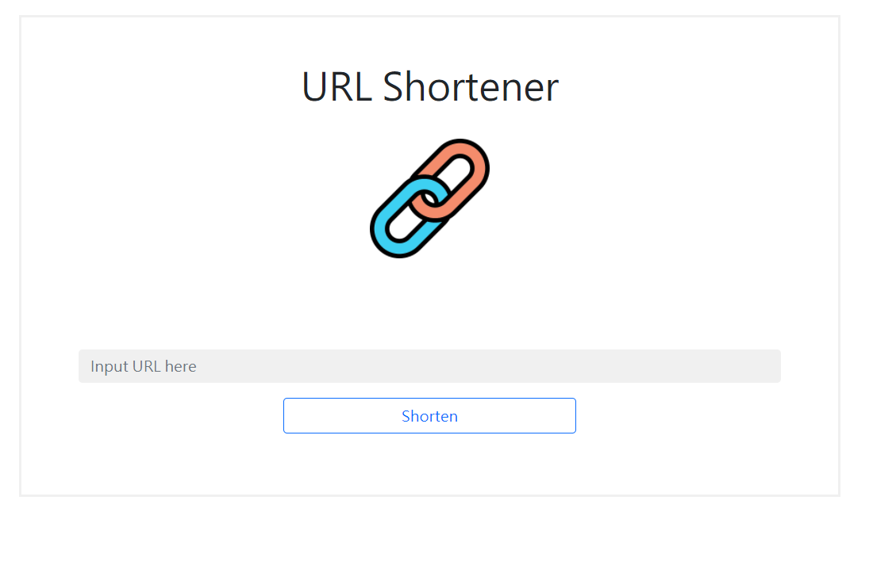
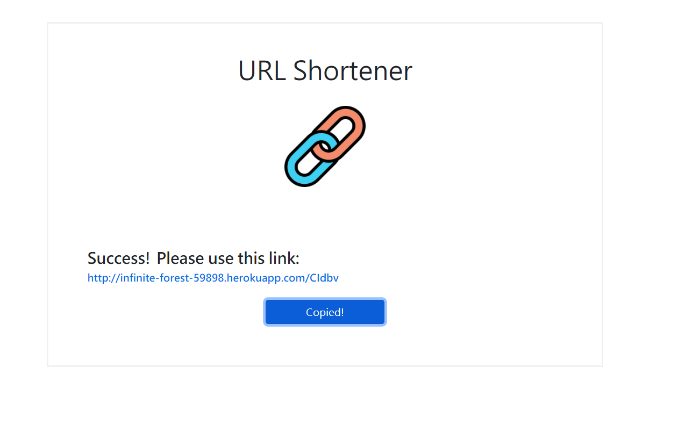

# AC學期2-3_A14_Shorten URL

AlphaCamp學期2-3，A14的Shorten URL的專案，  
使用 Node.js , Express , express-handlebars，可以將長的URL縮短。  
上傳至Heroku之後為 https://infinite-forest-59898.herokuapp.com/

## 功能描述

- 首頁畫面上有一個表單，使用者可以在表單輸入原始網址，送出表單之後，畫面會回傳格式化後的短網址。
- 並這些縮短網址中輸入相同網址時，產生一樣的縮址。

## Screenshots




### 安裝與執行步驟

1. 開啟終端機(Terminal)cd 到存放專案本機位置並執行:

```
git clone https://github.com/CarolLiuXQ/AC_S23_A14_shortenURL
```

2. 初始

```
cd AC_S23_A14_shortenURL //切至專案資料夾
```

```
npm install  //安裝套件
```

3. 啟動專案

```
npm run dev  //執行程式
```

4. 開始使用
終端顯示 `App running on port 3000` 即啟動完成，請至[http://localhost:3000](http://localhost:3000)開始使用程式


## 環境建置與需求

- [Visual Studio Code](https://visualstudio.microsoft.com/zh-hant/) -1.57.1
- [Node Version Manager (nvm) for Windows](https://github.com/coreybutler/nvm-windows/releases) -1.1.7
- npm -6.14.13
- [Express](https://www.npmjs.com/package/express)
- [Express-Handlebars](https://www.npmjs.com/package/express-handlebars)
- [body-parser](https://www.npmjs.com/package/body-parser)
- [nodemon](https://www.npmjs.com/package/nodemon)
- [mongoose](https://www.npmjs.com/package/mongoose)

## License
© [CarolLiu](https://github.com/CarolLiuXQ/)