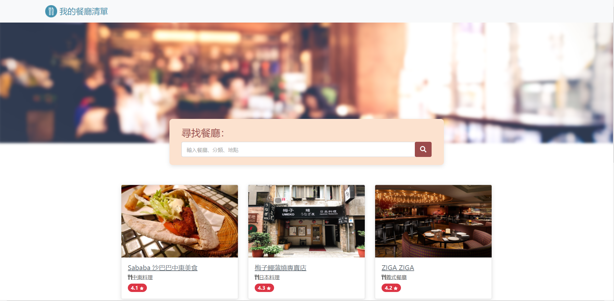

# AC學期2-3_A3_Q1_Restaurant_List

AlphaCamp學期2-3，A3作業專案的Restaurant_List，  
使用 Node.js , Express , express-handlebars 打造的餐廳美食網站。

## 功能描述

- 可在搜尋列輸入「餐廳名稱」、「餐廳分類」、「餐廳地點」，便可搜索出相關餐廳。
- 如無相關搜索餐廳的話，會顯示「請繼續搜尋」等字眼。
- 檢視餐廳詳細資訊包含類別、地址、電話、評分、圖片及 Google Map。
- 具RWD，在手機版的螢幕尺寸時，可以一行一張卡片瀏覽。

## Screenshots




### 安裝與執行步驟

1. 開啟終端機(Terminal)cd 到存放專案本機位置並執行:

```
git clone https://github.com/CarolLiuXQ/S23_A3_Q1_restaurant_list.git
```

2. 初始

```
cd S23_A3_Q1_restaurant_list  //切至專案資料夾
```

```
npm install  //安裝套件
```

3. 啟動專案

```
npm run start  //執行程式
```

4. 開始使用
終端顯示 `Express is listening on http://localhost:3000` 即啟動完成，請至[http://localhost:3000](http://localhost:3000)開始使用程式


## 環境建置與需求

- [Visual Studio Code](https://visualstudio.microsoft.com/zh-hant/) -1.57.1
- [Node Version Manager (nvm) for Windows](https://github.com/coreybutler/nvm-windows/releases) -1.1.7
- npm -6.14.13
- [Express](https://www.npmjs.com/package/express)
- [Express-Handlebars](https://www.npmjs.com/package/express-handlebars)
- [nodemon](https://www.npmjs.com/package/nodemon)


## License
© [CarolLiu](https://github.com/CarolLiuXQ/)