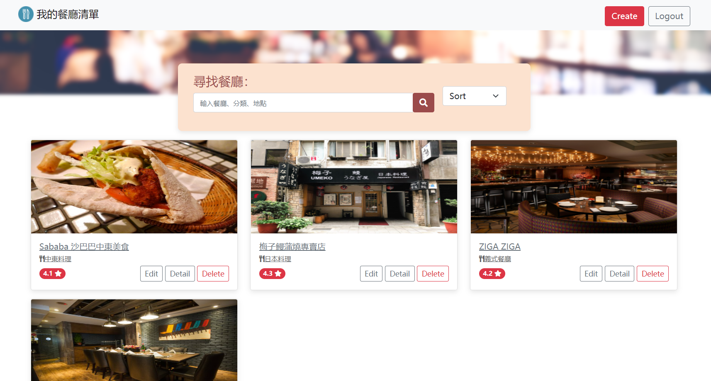
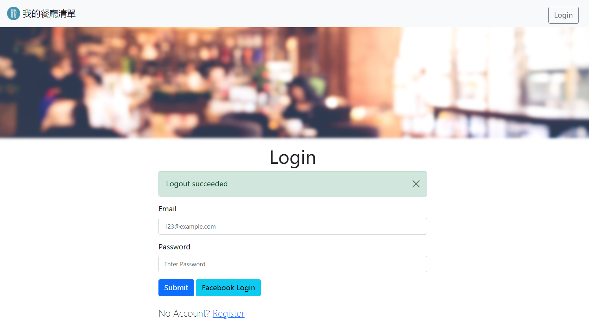
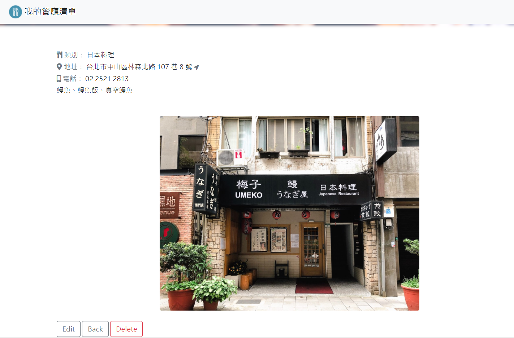

# AC學期3_A1_Q1_Restaurant_List4.0

AlphaCamp學期3，A8作業專案的Restaurant_List4.0，  
使用 Node.js , Express , express-handlebars 打造的餐廳美食網站。  
上傳至Heroku為以下網址，
https://secret-falls-29012.herokuapp.com/users/login

## 功能描述

- 使用者可以註冊帳號
- 使用者也可以透過 Facebook Login 直接登入
- 登入後，使用者可以建立並管理專屬他的一個餐廳清單
- 使用者登出、註冊失敗、或登入失敗時，使用者都會在畫面上看到正確而清楚的系統訊息
- 可在搜尋列輸入「餐廳名稱」、「餐廳分類」、「餐廳地點」，便可搜索出自己的相關餐廳
- 如無相關搜索餐廳的話，會顯示「No Results」等字眼
- 檢視餐廳詳細資訊包含類別、地址、電話、評分、圖片及 Google Map
- 具RWD，在手機版的螢幕尺寸時，可以一行一張卡片瀏覽
- 使用者可以新增一家餐廳
- 使用者可以修改一家餐廳的資訊
- 使用者可以刪除一家餐廳
- 使用者可根據「地點」、「降冪」、「升冪」、「類別」進行排序

## Screenshots






### 安裝與執行步驟

1. 開啟終端機(Terminal)cd 到存放專案本機位置並執行:

```
git clone https://github.com/CarolLiuXQ/AC_S3_A1_Q1_restaurant_list4.0.git
```

2. 初始

```
cd AC_S3_A1_Q1_restaurant_list4.0  //切至專案資料夾
```

```
npm install  //安裝套件
```

3. 建立 .env 檔案
參照 .env.example 在專案根目錄建立 .env 檔案


4. 產生種子檔案
```
npm run seed
```

5. 啟動專案

```
npm run dev  //執行程式
```

6. 開始使用
終端顯示 `Express is listening on http://localhost:3000` 即啟動完成，請至[http://localhost:3000](http://localhost:3000)開始使用程式


## 環境建置與需求

- [Visual Studio Code](https://visualstudio.microsoft.com/zh-hant/) -1.57.1
- [Node Version Manager (nvm) for Windows](https://github.com/coreybutler/nvm-windows/releases) -1.1.7
- npm -6.14.13
- [Express](https://www.npmjs.com/package/express)
- [Express-Handlebars](https://www.npmjs.com/package/express-handlebars)
- [body-parser](https://www.npmjs.com/package/body-parser)
- [method-override](https://www.npmjs.com/package/method-override)
- [nodemon](https://www.npmjs.com/package/nodemon)
- [bcryptjs](https://www.npmjs.com/package/bcryptjs)
- [express-session](https://www.npmjs.com/package/express-session)
- [connect-flash](https://www.npmjs.com/package/connect-flash)
- [dotenv](https://www.npmjs.com/package/dotenv)
- [mongoose](https://www.npmjs.com/package/mongoose)
- [passport](https://www.npmjs.com/package/passport)


## License
© [CarolLiu](https://github.com/CarolLiuXQ/)